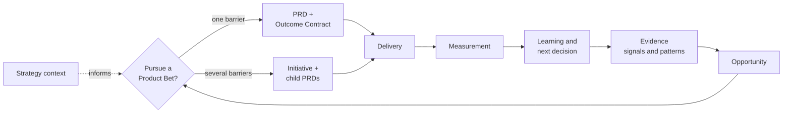

# Product OS

**Product decision infrastructure for agentic teams.**

AI made documents and code cheap. It did not make good decisions cheap. Teams can now ship faster than they can work out what is worth shipping, or whether the last thing worked.

Product OS turns the path from evidence to bet to contract to delivery to measured learning into an inspectable trail rather than an oral tradition. It is built for a Product Lead whose team already writes code with agents, and whose evidence is scattered across meeting notes, the delivery tracker, analytics, and people's heads. It adds no product-management UI.

The goal is not more documents. It is more completed **evidence-backed learning loops**.

[](https://github.com/abalyasnikov/product-os/actions/workflows/ci.yml)
[](docs/spec/product-os.md)
[](pyproject.toml)
[](LICENSE)

It grew out of running product this way on a real team. [How I rebuilt product work around coding agents](https://balyasnikov.com/writing/product-work-around-coding-agents) is the field report: what broke, what replaced it, and the trading case the worked example below comes from.

## What it produces

Product artifacts in Git, where the rule for judging success is written down before delivery and the result is checked against it afterwards. This is the Outcome Contract carried by the worked example's PRD, its binding still `planned` and due before release:

```yaml
definition:
  baseline: approximately 15% of initiated trades failing in the low-market-cap segment;
    the aggregate rate reads as noise and must not be used as the baseline
  metric: eligible native swaps and bridges failing because the accepted slippage tolerance was exceeded
  window: 14 days after measurable controlled exposure
  guardrails: [median_execution_delta_from_quote, trading_revenue_per_eligible_transaction]
  decision_rule: Scale only when eligible failure rate improves and neither guardrail
    materially regresses; otherwise revise the technical hypothesis or stop.
binding:
  status: planned
  owner: product-lead
  due_before: release
```

And this is the Learning recorded against it after the change shipped:

```yaml
results:
  by_slice:
    low_market_cap_assets: "~15% to ~2%"
    aggregate_all_assets: "No material movement; at this scale the aggregate failure rate looked like noise both before and after"
  guardrails:
    median_execution_delta_from_quote: null
    trading_revenue_per_eligible_transaction: null
decision_events:
  - kind: outcome
    choice: iterate
```

The number the team cared about went from roughly 15% to roughly 2%, and the recorded decision is still `iterate` rather than `scale`. The two guardrails its author committed to were never recovered, and the decision rule written before shipping does not permit `scale` without them. The contract decides what counts as a win, not the person who wrote it.

Both blocks are excerpts from real files: [the PRD](examples/best-in-class-trading-experience/product/prds/auto-slippage.md) and [the Learning](examples/best-in-class-trading-experience/product/learnings/auto-slippage-failure-rate.md).

## Where the product loop breaks

Six failures, and the mechanism that closes each one. The enforcement detail is in the [specification](docs/spec/product-os.md).

| Where the loop breaks | What closes it |
| --- | --- |
| **Work starts from an idea, not a problem.** By the time someone writes a PRD, the discovery questions are gone: where the request came from, how many users are behind it, who contradicts it. | Signal to Pattern to Opportunity, each carrying its source. Patterns must hold the contradicting evidence too, and a mention count is never treated as representativeness. Deciding anyway takes a dated waiver. |
| **Well-argued work the company already declined.** Evidence proves a problem is real. It does not prove the problem is yours, or that now is when you deal with it. | One readable `context/strategy.md` that every workflow judging strategic fit has to read. Missing or stale, it becomes a named gap. One file on purpose: a strategy that grows into a second database stops being read. |
| **Decisions cannot be reconstructed.** Six months later, why the team did this and who decided gets rebuilt from memory and chat history. | Three human decisions, each an append-only event with author, date, rationale, and the approved Git version. Approval comes from a merged review or a commit trailer, not a field anyone can edit. |
| **Success is declared, not measured.** Shipped turns into worked, and the metric gets picked after the fact to fit the conclusion. | The Outcome Contract splits what better means from how it gets measured. The definition gates approval. Handoff needs a binding at least owned and dated; Outcome Review needs it resolved, with a recorded anchor and an elapsed window. |
| **Context dies at handoff.** Engineering and coding agents get a ticket title. Intent, constraints, and non-goals stay in the PM's head. | The delivery project is created from the approved Git version and carries versioned context. Product owns why, what, and outcome; engineering owns how, in an Implementation Plan that cannot silently redefine the PRD. |
| **The PM tool becomes a second tracker.** Every system promising order demands hand-maintained statuses that go stale and inboxes that pile up. | Lifecycle is derived, not maintained. The Decision Queue is computed on request, never stored, and lists only human decisions. An artifact exists when a decision needs it. |

## Try with your agent

Prerequisites: macOS or Linux, `git`, and [`uv`](https://docs.astral.sh/uv/getting-started/installation/).
Windows is deferred because the installer relies on POSIX file-safety primitives.

Clone this repository:

```bash
git clone https://github.com/abalyasnikov/product-os.git
```

Open the checkout in your agent and use the matching prompt:

- **Codex:** “Show me how Product OS works using the included example. Don't install anything. Run the reference journey with `--client codex`.”
- **Claude Code:** “Show me how Product OS works using the included example. Don't install anything. Run the reference journey with `--client claude-code`.”

The agent runs `uv run --directory <checkout> python scripts/run_reference_journey.py --client <own-client>`.
If `uv` is unavailable, it reads one Signal → Opportunity → PRD → Learning from
`examples/best-in-class-trading-experience/`. The demo ends by offering to preview one of your
own notes as a Signal without writing it, then offers installation.

## Install with your agent

This repository is the machinery: schemas, templates, agent skills, and the checks that keep them
honest. It is not where your product work goes. Strategy, evidence, PRDs, decisions, and learnings
belong in a private repository you own, and that is what the installer writes into. Keeping the two
apart is the point: your evidence and strategy stay private, and you can pull a newer version of the
machinery without it touching a single product decision you have made. Product OS never creates that
second repository for you, so make an empty private repo first if you do not have one.

> [!IMPORTANT]
> No release has been published yet, so one-link installation stays disabled by design. The only
> accepted source is a local checkout at a commit you confirm yourself. The installer fails closed
> rather than trusting a URL it cannot pin, which is why the first step is a clone you can inspect
> rather than a link you paste.

The natural install session is the same trusted source-checkout session. Give your agent the
target private repository and ask it to follow `INSTALL.md`:

- **Codex:** “Install Product OS from this checkout into `<target>`, with Codex selected. Show the short plan preview and wait for confirmation.”
- **Claude Code:** “Install Product OS from this checkout into `<target>`, with Claude Code selected. Show the short plan preview and wait for confirmation.”

The agent shows you the origin, commit, target, configuration, and every write before it touches
anything. The worked example is not copied into the target; it remains in this source clone at
`examples/best-in-class-trading-experience/`. Safe checked updates use the same plan-hash flow;
see [Update](INSTALL.md#update).

See [INSTALL.md](INSTALL.md) for the installation contract, and the
[solo walkthrough](docs/getting-started.md) for the path from a first signal to a decision you can
defend later, with no connectors required.

## How it works

Most spec-driven systems begin with an idea or feature request, and most delivery systems end at
merge or release. Product OS starts earlier and stops later: where the problem came from and how
representative the evidence is, through to the observed user outcome and the updated product thesis.



Evidence establishes that a problem is real. Strategy context establishes that it is yours to act on now. A loop running on evidence alone will produce a well-argued case for work the company has already decided against.

A small Product Bet is represented by one PRD. When one outcome requires several independent interventions, an optional Initiative groups the child PRDs and owns the shared Outcome Contract. Product Bet is a decision and learning unit, not another mandatory file.

Three judgments remain human-owned:

- pursue, hold, or reject an Opportunity;
- approve the Product Bet contract before delivery handoff;
- scale, iterate, hold, kill, or complete after Outcome Review.

Agents investigate, question, draft, link, measure, and recommend between those decisions.

A PRD here is a concise product contract rather than an implementation specification. It carries the problem and its business reality, evidence and confidence including gaps and contradictions, the JTBD and the current to desired journey, requirements and non-goals, the Outcome Contract, the GTM hypothesis, risks and open questions, and links into the configured delivery system. See [the template](templates/prd.md).

When implementation design needs durable detail, engineering owns a separate Implementation Plan in the relevant code repository. It may define architecture, APIs, rollout, and technical trade-offs, but it cannot replace or silently redefine the approved PRD.

The agent is the interface, and Git stores the product artifacts and the decision trail. Granola, Linear, Amplitude, Mixpanel, Metabase, and other existing providers keep owning their source data, and you bring those connections yourself: each is an already configured provider MCP with its own credentials. Product OS ships no server, no client, and no transport, and it never falls back to browser automation or an unofficial API client. When a provider is absent, the workflow that needed it reports a named gap instead of quietly proceeding without it.

## Worked example: Best-in-class trading experience

The [historical Zerion example](examples/best-in-class-trading-experience/README.md) shows one company ambition becoming a single Product Bet with five focused PRDs:

```text
context/strategy.md                  ← what every document below was argued against
Initiative: Best-in-class trading experience
  → Cross-chain Swap
  → Auto-slippage for Native Swaps and Bridges
  → Skip Signing Screen for Native Transactions
  → Transaction Toasters
  → Bridge Progress Tracking
```

No two barriers surfaced the same way. Consolidated support reports plus segmented telemetry found one. A first-use walkthrough found another. The rest came from a moving competitive baseline, from inspecting the product's own flows, and from reviewing what another PRD in the same bet depended on. That mix is the argument for the structure: a system fed only by customer requests would have found one of the five.

Auto-slippage is the one that closes the loop, and its contract is the one quoted above: at the aggregate level the failure rate read as noise, and only segmentation found the asset band where it mattered. Everywhere else, proposed measures stay proposed rather than being filled in with synthetic certainty. Personal names, private links, exact revenue figures, and unsupported post-release claims are omitted.

Start with the [strategy context](examples/best-in-class-trading-experience/context/strategy.md), then the [Initiative](examples/best-in-class-trading-experience/product/initiatives/best-in-class-trading-experience.md), then any child PRD.

## What it does not do

It does not replace Linear or Jira, analytics tools, transcript providers, code repositories, engineering planning, or GTM execution. It ships no additional UI and no custom MCP server. Every one of those systems keeps owning its own data; Product OS owns the decision trail that runs between them.

## Verification boundaries

The reference journey is a suite of unit and contract tests for the operating model. It exists to catch artifacts that read convincingly but do not hold together: a decision event rewritten after the fact, an approval pointing at a version that never existed, a Learning bound to an outcome definition its owner no longer uses.

Passing it means the decision trail is sound. It says nothing about whether a Product Lead made a good call, whether discovery was thorough, or whether a connector returns what it claims.

> [!NOTE]
> Synthetic technical proof is never presented as a real customer outcome, and the historical example contains no fabricated production result. See the [verification model](docs/verification.md) for the exact claim boundary.

## Project status

This is a V1 reference implementation. Its release bar is an inspectable evidence-to-learning journey, not feature count. The [release checklist](docs/release-checklist.md) states plainly what CI already enforces and what still needs a human.

- [Product specification](docs/spec/product-os.md)
- [Solo walkthrough](docs/getting-started.md) — evidence to decision without any connector
- [Verification model](docs/verification.md) — what the suite proves, and where its coverage stops
- [Security model](docs/security-model.md)
- [Contributing and local verification](docs/contributing.md)
- [Apache 2.0 license](LICENSE)

The two decisions the rest of the system rests on are recorded as ADRs: [product truth stays separate from delivery and implementation](docs/architecture/0001-boundaries.md), and [learning anchors to observation rather than project completion](docs/architecture/0002-measurement-anchor.md).
