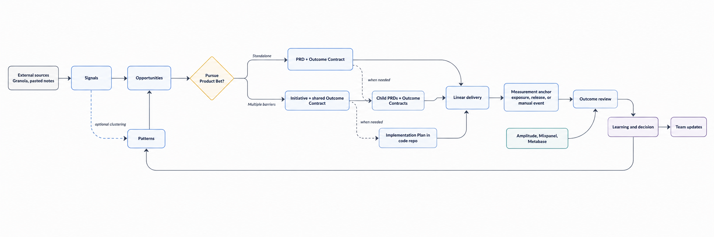

# Product Decision OS

**Product decision infrastructure for agentic teams.**

Product Decision OS helps Product Leads and PMs turn customer evidence into approved product bets, delivery context, and measured learning without introducing another product-management UI.

[](docs/spec/product-decision-os.md)
[](LICENSE)

[](docs/assets/product-loop.png)

## Why this exists

Spec-driven tools usually begin with an idea or feature request. They rarely preserve where the problem came from, whether the evidence is representative, or what happened after release. Product Decision OS keeps the complete decision chain inspectable:

```text
evidence → opportunity → product bet → PRD → delivery → measurement → learning
```

The primary interface is an agent such as Codex, Claude Code, or OpenClaw. Git stores the product truth. Existing MCP providers connect transcripts, delivery, and analytics.

## What it owns

- Traceable Signals, Opportunities, optional Initiatives, PRDs, Outcome Contracts, and Learnings.
- Human review and immutable product decisions.
- PRD interrogation that asks questions before drafting.
- Outcome definitions and evals before delivery.
- Context projections for Linear, engineering agents, leaders, and team updates.
- A computed Decision Queue for judgments that need human attention.

It does not replace Linear, analytics tools, transcript providers, code repositories, or engineering planning. It ships no custom MCP server and no additional UI.

## Repository map

```text
schemas/                 Validated artifact contracts
templates/               Human-readable Markdown templates
skills/                  Canonical agent-neutral workflows
adapters/                Generated client instructions and metadata
integrations/            Capability mappings for existing provider MCPs
src/product_decision_os/ Deterministic validation CLI
examples/fixtures/       Anonymized reference and failure journeys
docs/spec/               Normative product specification
docs/architecture/       Durable implementation decisions
tests/                    Validator, skill, and end-to-end coverage
```

## Try the reference implementation

Requirements: Python 3.11+.

```bash
python -m venv .venv
source .venv/bin/activate
python -m pip install -e '.[dev]'
product-os validate examples/fixtures/valid-workspace
product-os smoke-test examples/fixtures/valid-workspace
python -m pytest
```

All smoke tests are read-only. They do not create Linear projects or mutate analytics data.

The Python package contains the deterministic validator only. Canonical schemas, templates, skills, adapters, and integration mappings are installed from an immutable Git release so their provenance remains inspectable; a Python wheel is not a substitute for the Product Decision OS distribution.

## Install with an agent

For local development, send your agent the absolute path to [INSTALL.md](INSTALL.md) and explicitly confirm the local repository path and commit. After the first public release, use the commit-pinned public URL published in the release notes. Do not use a branch or mutable tag URL.

The agent will:

1. show the source commit and files it plans to install;
2. ask for a private target repository;
3. install the canonical schemas, templates, skills, and client adapter;
4. configure only the provider MCPs you choose;
5. run read-only smoke tests;
6. show the proposed Git commit before writing it.

The public one-link flow is intentionally unavailable while `manifest.json` reports `canonical_origin: unpublished`; this prevents a mutable or invented URL from becoming trusted installation guidance.

## Start with a product question

After setup, talk to the agent naturally:

```text
Find the Granola calls about failed first swaps, show contradictory evidence,
and help me decide whether this deserves a Product Bet.
```

```text
Interrogate me before drafting the PRD. Do not hand off to Linear until the
Outcome Contract is complete and the configured reviewer has approved it.
```

```text
What product decisions need my attention, and what evidence changed since
the last approved version?
```

No Granola connection is required for the first loop:

```text
Use this pasted note as local evidence. Preserve only a fingerprint and normalized
Signal, show me the exact Git payload, then help me decide whether to pursue it.
```

Additional workflows:

```text
This outcome has two independent barriers. Help me decide whether it needs an
Initiative, then define the shared Outcome Contract before drafting child PRDs.
```

```text
The rollout is exposed. Run Outcome Review from the configured measurement anchor,
show results by slice and guardrail, and ask me for the next decision.
```

```text
Prepare this month's Product Update. Block any material claim that lacks a structured
artifact, Linear, or analytics source reference.
```

See the [five-minute solo walkthrough](docs/getting-started.md) for the complete first loop and recovery paths.

## Product model

- **Signal:** one decision-relevant observation with source provenance.
- **Opportunity:** a problem worth an explicit pursue, hold, or reject decision.
- **Product Bet:** the logical investment and learning unit, not another file. A small Bet uses its PRD ID; a multi-PRD Bet uses its Initiative ID.
- **Initiative:** optional grouping for one outcome that requires multiple PRDs.
- **PRD:** the approved product contract for one coherent problem or barrier.
- **Implementation Plan:** optional engineering-owned plan stored in a code repository and linked by PRD version.
- **Outcome Contract:** what better means, how it will be observed, and which result triggers which decision.
- **Learning:** the observed result and human `scale`, `iterate`, `hold`, `kill`, or `complete` decision.

Read the [full product specification](docs/spec/product-decision-os.md) for lifecycle, evidence, privacy, review, measurement, and integration rules.

## Project status

This repository is a V1 reference implementation. The release bar is an inspectable evidence-to-learning journey, not feature count. See [IMPLEMENTATION_PLAN.md](IMPLEMENTATION_PLAN.md) for current acceptance criteria.

## License

Apache License 2.0. See [LICENSE](LICENSE).
