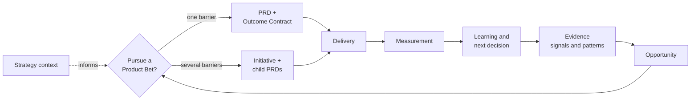

# Product OS

**Product decision infrastructure for agentic teams.**

[](https://github.com/abalyasnikov/product-os/actions/workflows/ci.yml)
[](docs/spec/product-os.md)
[](pyproject.toml)
[](LICENSE)

AI made documents and code cheap. It did not make good decisions cheap. Teams can now ship faster than they can work out what is worth shipping, or whether the last thing worked — and the evidence that would tell them sits scattered across meeting notes, the delivery tracker, analytics, and people's heads.

- Product decisions live in your Git repository as Markdown. The agent reads and writes them; no UI, no server, no database.
- Evidence → opportunity → PRD with an Outcome Contract → delivery → measured learning. Three decisions stay yours: pursue, approve, and what to do with the result.
- Success is defined before delivery and checked against that definition afterwards, so "we shipped it" cannot quietly become "it worked".
- Built for a team already working with coding agents. If your PMs do not touch Git, the interface will exclude them, and no amount of tooling here fixes that.

Most spec-driven systems begin with an idea or a feature request, and most delivery systems end at merge or release. Product OS starts earlier and stops later: where the problem came from and how representative its evidence is, through to the observed user outcome and the updated product thesis.



It grew out of running product this way on a real team. [How I rebuilt product work around coding agents](https://balyasnikov.com/writing/product-work-around-coding-agents) is the field report: what broke, what replaced it, and the trading case the worked example below comes from.

## Six questions that usually have no answer

**"Where did this even come from?"**
By the time someone writes a PRD the discovery questions are gone: who asked, how many people are behind it, who contradicts it. Evidence here carries its source forward, contradictions included, and a mention count is never treated as representativeness. Deciding without evidence takes a dated waiver rather than silence.

**"Is this ours to do, and is now the time?"**
Evidence proves a problem is real. It does not prove the problem is yours. One readable `context/strategy.md` holds positioning, the year's goal, ordered principles, and the MUST/WON'T bands, and every workflow judging strategic fit has to read it. Missing or past its review date, it becomes a named gap instead of a silent assumption.

**"Why did we decide this?"**
Six months on, this gets rebuilt from memory and chat history. Three human decisions are recorded as append-only events carrying author, date, rationale, any conditions attached to them, and the approved Git version. Approval comes from a merged review or a commit trailer, not a status field anyone can edit.

**"Did it actually work?"**
Shipped turns into worked, and the metric gets chosen afterwards to fit the conclusion. The Outcome Contract separates what better means from how it will be measured: the definition gates approval, and Outcome Review stays shut until the binding resolves, a real measurement anchor exists, and the window has elapsed.

**"What did engineering actually get?"**
A ticket title, while the intent, the constraints, and the non-goals stayed in the PM's head. Delivery inherits the approved Git version with its context. Product owns why, what, and the outcome; engineering owns how, in an Implementation Plan that cannot silently redefine the contract.

**"What needs me right now?"**
Every system promising order ends up demanding statuses that someone maintains until they go stale. Lifecycle is derived from the artifacts instead, and the queue is computed on request and never stored.

The enforcement detail behind each of these is in the [specification](docs/spec/product-os.md).

## What using it looks like

You talk to your agent. When you ask what needs you, the answer is derived from your files rather than from a board somebody updated:

```console
$ product-os queue examples/receipt-follow-up --as-of 2026-09-20
1. The admin who owns the close cannot get receipts in without chasing people by hand — confirm, waive, supersede — A condition attached to this decision came due on 2026-09-15: Talk to at least three cardholders before any requirement is treated as fixed.
   next: Confirm the condition was met, record an explicit waiver, or append a superseding decision. Do not leave it unanswered.
2. The admin who owns the close cannot get receipts in without chasing people by hand — confirm, waive, supersede — A condition attached to this decision came due on 2026-09-15: The outcome must be measurable on the single-admin segment specifically, because the aggregate compliance number cannot show it.
   next: Confirm the condition was met, record an explicit waiver, or append a superseding decision. Do not leave it unanswered.
3. The system runs the receipt follow-up instead of the admin — confirm, withdraw, renew — The evidence waiver on this artifact came up for review on 2026-09-15 and the assumption it covers is still unconfirmed.
   next: Get the evidence the waiver stood in for, or record that the assumption is now accepted and why.
   gap: Cardholders miss receipts because they forget, not because attaching one is hard or because they are refusing, so a timely prompt to the right person recovers the receipt.

Could not be checked:
- No `.product-os/config.yaml`: review mode and connectors are unknown, so approval state could not be resolved.
- Approval for `prd_01RCPT001` is unknown. Review mode is not configured.

3 decision(s) across 1 bet(s), 6 artifact(s), as of 2026-09-20.
```

That is a real command against an example in this repository, printed verbatim. Two things it is doing on purpose: a condition someone attached to a decision months ago is not quietly forgotten, and what could not be checked is named rather than omitted, because an empty queue and an unchecked one must never look the same.

There are two commands in total. `product-os queue` answers the question above. `product-os check` verifies that the trail holds together: schemas, the relationship graph, decision events that were appended and never rewritten, approvals pointing at commits that exist, and no credential or transcript in an artifact.

## What it produces

Product artifacts in Git, where the rule for judging success is written down before delivery and the result is checked against it afterwards. This is the Outcome Contract carried by the worked example's PRD, its binding still unresolved when the contract was approved:

```yaml
definition:
  baseline: approximately 15% of initiated trades failing in the low-market-cap segment;
    the aggregate rate reads as noise and must not be used as the baseline
  metric: eligible native swaps and bridges failing because the accepted slippage tolerance was exceeded
  guardrails: [median_execution_delta_from_quote, trading_revenue_per_eligible_transaction]
  decision_rule: Scale only when eligible failure rate improves and neither guardrail
    materially regresses; otherwise revise the technical hypothesis or stop.
binding:
  status: planned
```

And this is the Learning recorded against it after the change shipped:

```yaml
results:
  by_slice:
    low_market_cap_assets: "~15% to ~2%"
    aggregate_all_assets: "No material movement; at this scale the aggregate failure rate looked like noise both before and after"
  guardrails:
    median_execution_delta_from_quote: null
    trading_revenue_per_eligible_transaction: null
decision_events:
  - kind: outcome
    choice: iterate
```

The number the team cared about went from roughly 15% to roughly 2%, and the recorded decision is still `iterate` rather than `scale`. The two guardrails its author committed to were never recovered, and the decision rule written before shipping does not permit `scale` without them. The contract decides what counts as a win, not the person who wrote it.

Both blocks are excerpts from real files: [the PRD](examples/best-in-class-trading-experience/product/prds/auto-slippage.md) and [the Learning](examples/best-in-class-trading-experience/product/learnings/auto-slippage-failure-rate.md).

## What your repository looks like

Yours, readable without any tool, and unremarkable in a diff:

```text
README.md                       what this repository holds
AGENTS.md, CLAUDE.md            routing for your agent, yours to edit after install
context/strategy.md             positioning, this year's goal, ordered principles, MUST/WON'T
product/
  signals/                      one falsifiable observation each, with its source
  opportunities/                problems worth a decision, with the decision appended to them
  prds/                         the contract for one problem, and how success will be judged
  learnings/                    what the measurement showed, and what was decided because of it
.product-os/                    installed machinery — schemas, templates, skills. Do not hand-edit.
.claude/skills/                 route-only wrappers so your agent finds the workflows
```

No `inputs/` by default. You paste a note to your agent; Git receives a normalized Signal and a SHA-256 fingerprint of what you pasted, and the raw text stays out. That is what keeps customer wording and names out of a repository you may later share.

## How it works

Evidence establishes that a problem is real. Strategy context establishes that it is yours to act on now. A loop running on evidence alone will produce a well-argued case for work the company has already decided against.

A small Product Bet is one PRD. When one outcome needs several independent interventions, an optional Initiative groups the child PRDs and owns the shared Outcome Contract. Product Bet is a decision and learning unit, not another mandatory file — and most bets never need a Pattern or an Initiative at all.

Three judgments stay human-owned: pursue, hold, or reject an Opportunity; approve the contract before delivery handoff; and choose scale, iterate, hold, kill, or complete after Outcome Review. Agents investigate, question, draft, link, measure, and recommend between them.

A PRD here is a concise product contract, not an implementation specification: the problem and its business reality, evidence with its gaps and contradictions, the JTBD and the current-to-desired journey, requirements and non-goals, the Outcome Contract, the GTM hypothesis, risks, open questions, and links into delivery. See [the template](templates/prd.md). When implementation design needs durable detail, engineering owns a separate Implementation Plan in the code repository.

Granola, Linear, Amplitude, Mixpanel, Metabase, and other providers keep owning their source data, and you bring those connections yourself: each is an already configured provider MCP with its own credentials. Product OS ships no server, no client, and no transport, and never falls back to browser automation or an unofficial API client. When a provider is absent, the workflow that needed it reports a named gap instead of quietly proceeding.

It does not replace Linear or Jira, analytics tools, transcript providers, code repositories, engineering planning, or GTM execution. It owns the decision trail that runs between them.

## Worked examples

**[Receipt follow-up](examples/receipt-follow-up/README.md) — the short path.** Four Signals, one Opportunity, one PRD, and nothing else: no Pattern, no Initiative, no Learning yet. It is what most bets look like, and it shows two things a large example hides — an ordered strategy rejecting the loudest customer request into a PRD's non-goals, and a `pursue` decision whose dated condition the PRD then has to answer with an explicit waiver. Its loop is open on purpose, which is the honest state of a bet on the day it is approved.

**[Best-in-class trading experience](examples/best-in-class-trading-experience/README.md) — a multi-PRD bet that closed.** One company ambition becoming a single Product Bet with five focused PRDs, carrying the evidence they were argued from:

```text
context/strategy.md                  ← what every document below was argued against
Opportunity: make trading continuous across chains and transaction states
Initiative: Best-in-class trading experience
  → Cross-chain Swap
  → Auto-slippage for Native Swaps and Bridges      ← the one that closes the loop
  → Skip Signing Screen for Native Transactions
  → Transaction Toasters
  → Bridge Progress Tracking
```

No two barriers surfaced the same way: consolidated support reports plus segmented telemetry found one, a first-use walkthrough another, the rest came from a moving competitive baseline and from inspecting the product's own flows. A system fed only by customer requests would have found one of the five. Personal names, private links, and exact revenue figures are omitted, and proposed measures stay proposed rather than being filled in with synthetic certainty.

## Try it with your agent

Prerequisites: macOS or Linux, `git`, and [`uv`](https://docs.astral.sh/uv/getting-started/installation/). Windows is deferred because the installer relies on POSIX file-safety primitives.

```bash
git clone https://github.com/abalyasnikov/product-os.git
```

Open the checkout in your agent and ask, naming your own client (`codex`, `claude-code`, or `openclaw`):

> Show me how Product OS works using the included example. Don't install anything. Run the reference journey with `--client claude-code`.

The agent runs the deterministic journey from a clean Git repository. If `uv` is unavailable it reads the short path in `examples/receipt-follow-up/` instead. The demo ends by offering to preview one of your own notes as a Signal without writing it.

## Install with your agent

This repository is the machinery. It is not where your product work goes: strategy, evidence, PRDs, decisions, and learnings belong in a private repository you own, and that is what the installer writes into. Keeping the two apart is the point — your evidence stays private, and you can pull a newer version of the machinery without it touching a single decision you have made. Product OS never creates that second repository, so make an empty private repo first.

> [!IMPORTANT]
> No release has been published yet, so one-link installation stays disabled by design. The only accepted source is a local checkout at a commit you confirm yourself. The installer fails closed rather than trusting a URL it cannot pin.

In the same trusted session, give your agent the target repository:

> Install Product OS from this checkout into `<target>`, with Claude Code selected (or Codex, or OpenClaw). Show the short plan preview and wait for confirmation.

It shows the origin, the commit, whether that commit describes the bytes being installed, the target, the configuration, and every write before touching anything. Updates use the same plan-hash flow and stop before the first write if you have edited a managed file. See [INSTALL.md](INSTALL.md) for the full contract.

## Your first loop

Nothing here needs a connector; a private Git repository and an agent are enough.

> Draft `context/strategy.md` from the template. Interview me for positioning, this year's goal, ordered product principles, explicit trade-offs, and the MUST/SHOULD/COULD/WON'T bands.

Order the principles. Unordered principles cannot settle an argument, and settling arguments is the only thing a principle is for. This is the step people skip, and skipping it is why agents produce well-argued PRDs for work the company already declined.

> Turn this note into decision-relevant evidence. Store only a normalized Signal and a sha256 fingerprint of my pasted source. Show the payload before writing it.

> Does this evidence justify an Opportunity? Show gaps and contradictions first.

> Interrogate me before drafting. Ask no more than three questions at a time, and save a resumable checkpoint.

> Show my Decision Queue. If it is empty, tell me the next useful action.

Recovery is boring on purpose: a validation failure keeps the draft and names the field, an unverifiable approval stops delivery handoff, and a missing measurement anchor means the outcome window has not started, so no success claim is available yet.

## Verification boundaries

The reference journey is a suite of unit and contract tests for the operating model. It exists to catch artifacts that read convincingly but do not hold together: a decision event rewritten after the fact, an approval pointing at a version that never existed, a Learning bound to an outcome definition its owner no longer uses.

Passing it means the decision trail is sound. It says nothing about whether a Product Lead made a good call, whether discovery was thorough, or whether a connector returns what it claims. Synthetic technical proof is never presented as a real customer outcome, and the historical example contains no fabricated production result. The [verification model](docs/internal/verification.md) states the exact claim boundary.

## Project status

V1 reference implementation. Its release bar is an inspectable evidence-to-learning journey, not feature count; the [release checklist](docs/internal/release-checklist.md) states what CI already enforces and what still needs a human.

- [Product specification](docs/spec/product-os.md) — the operating model in full
- [Verification model](docs/internal/verification.md) — what the suite proves, and where coverage stops
- [Security model](docs/internal/security-model.md) · [Contributing](docs/internal/contributing.md) · [Apache 2.0](LICENSE)

The two decisions the rest of the system rests on are recorded as ADRs: [product truth stays separate from delivery and implementation](docs/internal/architecture/0001-boundaries.md), and [learning anchors to observation rather than project completion](docs/internal/architecture/0002-measurement-anchor.md).
