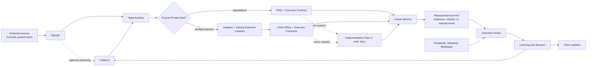

# Product Decision OS

Status: Draft

Working name: Product Decision OS

Working category: Product decision infrastructure for agentic teams

## Vision

Build an open-source, agent-native Product Decision OS for software teams.

Most spec-driven systems begin with an idea or feature request, after the most important discovery questions have already been compressed or lost. Most delivery systems stop at implementation, merge, or release readiness, before the real user outcome is known.

Product Decision OS begins with traceable evidence and ends with a measured product decision. It turns fragmented customer evidence into Product Bets, PRDs, Outcome Contracts, delivery context, Learnings, and team updates without requiring another product-management UI.

Its purpose is not to produce more documents. Its purpose is to help teams complete more evidence-backed learning loops:

> Understand where user value is blocked, decide what is worth pursuing, define how success will be judged, ship the smallest useful intervention, measure the result, and update the product thesis.

> From evidence to outcome, with the decision trail intact.

Git is the source of truth for product artifacts and recorded product decisions. A merged, reviewed change identifies the approved Git version; the Git provider retains reviewer discussion and identity. Git is not the source of truth for raw transcripts, engineering execution, or behavioral data. Existing MCP providers connect those external systems. Codex, Claude Code, OpenClaw, and other agents are the interface.

## Product thesis

AI makes drafting and implementation cheaper, but it does not decide which user problem matters, what evidence is trustworthy, or what outcome counts as success. Product Leads remain accountable for those judgments.

This product is an opinionated decision and context layer, not a feedback inbox, roadmap UI, data warehouse, generic PM framework library, or integration hub. It should make the complete path from evidence to learning inspectable while reducing the administrative work required to maintain that path.

A **Product Bet** is the logical unit receiving an investment decision and later producing a learning. It is represented by an Initiative when several PRDs contribute to one outcome, or by a standalone PRD for smaller work. Product Bet is not an additional mandatory file or folder. Signals, Patterns, and Opportunities inform a bet but are not delivery commitments.

## Users

### Primary ICP

Product Leads and Product Managers in software teams that:

- already use AI coding agents;
- have customer interviews, meeting notes, analytics, and delivery data distributed across tools;
- are constrained by product-context quality rather than development speed;
- want decisions and evidence to survive handoffs to engineering and agents.

### Downstream users

- Engineering teams receiving product context.
- PM managers reviewing bets and PRDs.
- Leadership reviewing progress and outcomes.
- AI agents executing discovery, planning, analysis, and delivery workflows.

## Core JTBD

1. **Turn raw signals into inspectable opportunities.** Identify repeated problems without losing original evidence, affected users, business weight, contradictions, or evidence coverage.
2. **Decide which product bets deserve investment.** Compare evidence, user impact, business impact, strategic fit, risk, and known delivery constraints.
3. **Create and maintain an executable PRD.** Interrogate the PM until the problem, outcome, scope, Outcome Contract, risks, and GTM hypothesis are clear; when evidence changes, show which approved assumptions may no longer hold.
4. **Preserve product intent through delivery.** Carry the approved PRD version, evidence, Outcome Contract, constraints, and decisions into Linear, implementation planning, and coding agents.
5. **Learn after shipping.** Compare production behavior with the baseline and Outcome Contract, inspect slices, and record the next product decision.
6. **Communicate progress without reconstructing it.** Generate weekly and monthly updates from the product source of truth.

## Product principles

1. **Evidence remains traceable.** Every product claim links to source material or an explicit evidence waiver.
2. **Evidence quality is visible.** Counts do not equal representativeness; coverage, concentration, recency, and contradictions remain explicit.
3. **Humans own product decisions.** Agents investigate, draft, compare, and recommend.
4. **Outcome before output.** A Product Bet defines how success will be judged before delivery begins.
5. **One contract, several proof methods.** The Outcome Contract may use cases, behavioral metrics, experiments, service levels, acceptance journeys, or qualitative rubrics.
6. **Context moves forward.** Delivery artifacts inherit product intent instead of receiving only ticket titles.
7. **Product intent and technical design have different owners.** Product owns why, what, constraints, and outcomes; engineering owns how.
8. **No parallel product database.** Git owns product artifacts; external systems retain their natural responsibilities.
9. **Minimal manual state.** Derive state from artifacts, approvals, Linear, and analytics wherever possible.
10. **No additional UI.** Agents are the product interface.
11. **No custom MCP servers.** Use existing provider MCPs.
12. **Private by default.** Do not commit credentials, full transcripts, or sensitive customer data.

## Product loop



## Artifact model

### Signal

An atomic piece of evidence describing user behavior, need, friction, request, or business impact.

It contains a stable ID, concise summary, source reference, dates, user segment or account reference, business weight when applicable, interpretation confidence, and an optional explicitly approved excerpt.

### Pattern

A derived grouping of related Signals. It preserves supporting and contradictory evidence, affected segments, frequency, business-weight summaries, recency, and known coverage gaps. Agent interpretation remains distinguishable from source facts; a high mention count is never presented as representative without segment coverage.

### Opportunity

A problem worth an explicit product decision. It captures blocked user value, evidence, affected users, impact, urgency, strategic fit, assumptions, risks, and an evidence-quality summary covering source diversity, segment concentration, recency, and contradictions.

The human-owned decision is recorded as an event: `pursue`, `hold`, or `reject`, with owner, rationale, and date. `pursue` authorizes creation of a product bet; it does not allocate engineering capacity. RICE is not a required field or workflow.

### Product Bet

The unit of product investment and learning. It connects a pursued Opportunity to an intended outcome, an Outcome Contract, delivery work, and a final decision.

Product Bet is a logical relationship rather than another mandatory artifact:

- a standalone PRD represents a small Product Bet;
- an Initiative plus its child PRDs represents a multi-PRD Product Bet.

### Initiative

An optional meta-layer representing a multi-PRD Product Bet around one shared user outcome. Use it when several distinct barriers must be solved to produce the target outcome. A small Product Bet moves directly from Opportunity to PRD.

It contains the target outcome, product thesis, initiative-level evidence and business impact, GTM hypothesis, initiative-level Outcome Contract, barriers, child PRDs, dependencies, sequencing, and accumulated learnings. It does not duplicate child PRD requirements.

The reference implementation includes a curated, anonymized historical Zerion example showing how one outcome can be decomposed into six problem-specific PRDs. Its provider links are sanitized and its measurement data is explicitly synthetic because the source repository contains no trustworthy post-release result. The private Zerion product repository is never a runtime dependency.

### PRD

The approved product contract for one coherent problem or barrier. It contains the problem, evidence, current and desired journey, outcome, requirements, non-goals, Outcome Contract, risks, dependencies, GTM hypothesis, and links to related artifacts.

A PRD defines why and what. Engineering owns implementation design.

### Implementation Plan

An optional downstream engineering artifact describing how an approved PRD will be implemented. Simple work does not require one. A PRD may reference zero or more plans when several codebases or independently owned technical systems are involved.

The canonical name is **Implementation Plan**; teams may use “Implementation Spec,” “Technical Spec,” or “Engineering Plan” as interface aliases. It normally lives in the relevant code repository and is owned by engineering, a tech lead, or a coding agent under engineering review. Product Decision OS stores only references:

```yaml
implementation_refs:
  - repository: github.com/example/product-app
    path: specs/first-swap/plan.md
    based_on_prd_id: prd_01JEXAMPLE
    based_on_prd_version: git-commit
```

An Implementation Plan may contain architecture, component boundaries, internal state machines, API and data contracts, migrations, rollout and rollback, observability, testing strategy, and technical trade-offs. Engineering tasks, estimates, and sequencing remain in Linear.

Durable architecture decisions that must survive plan regeneration belong in linked ADRs in the code repository. Product Decision OS keeps references to them through the Implementation Plan rather than copying them into the product repository.

User-visible behavior, journeys, product states, acceptance scenarios, requirements, and non-goals remain in the PRD even when an Implementation Plan exists. A plan cannot redefine the target user, product outcome, scope, or Outcome Contract. If implementation discovery requires one of those changes, the agent proposes a reviewed PRD change first.

When an approved PRD changes materially, the agent flags every plan based on an older PRD version for engineering review. It does not maintain a separate plan lifecycle or rewrite an external plan automatically.

The absence of an Implementation Plan does not block Linear Project creation unless the team's engineering policy explicitly requires one. Product Decision OS validates the reference shape and `based_on_prd_version`, not the plan's technical correctness or approval state.

### Outcome Contract

A logically first-class contract defining what better means, how it will be observed, and which result will trigger which product decision. It is colocated inside the PRD or Initiative by default. Large case sets or reusable contracts may use a separate linked file.

Every Product Bet requires an Outcome Contract, but the proof method depends on the work:

- **Case-based eval:** representative cases, slices, pass criteria, target threshold, and guardrails; especially useful for AI behavior.
- **Behavioral metric:** baseline, target movement, segments, measurement source, and window.
- **Experiment:** hypothesis, control, treatment, primary metric, guardrails, and decision rule.
- **Service level:** reliability, latency, quality, or operational threshold over a defined period.
- **Acceptance journey:** observable user journey with passing and failing scenarios.
- **Qualitative rubric:** explicit dimensions, examples, reviewers, and decision rule when quantitative measurement is not honest.

The contract separates the product definition from its technical binding:

```yaml
outcome:
  definition:
    baseline: 0.22
    target: 0.30
    metric: funded users completing first swap
    window: 14 days
    slices: [new_users, returning_users]
    guardrails: [failed_transaction_rate]
    decision_rule: scale if target passes without guardrail regression
  binding:
    status: planned # unconfigured | planned | executable | manual
    provider: amplitude
    query_reference:
    metric_definition_reference:
    definition_version:
    verified_by:
    verified_at:
    owner: analytics-team
    due_before: release
    measurement_anchor:
      type: exposure_event # exposure_event | release | manual
      reference:
```

The **measurement definition** is a product decision and must always include an observable baseline or current state, target outcome, method, relevant slices, guardrails, window or review date, and decision rule. The **measurement binding** connects that definition to a provider query, case set, review process, or manual result import. Its measurement anchor defines when the observation window starts: actual feature exposure when available, otherwise a verified release or explicit manual event.

A PRD may be approved when its definition is complete. Delivery handoff requires the binding to be `executable`, `manual`, or `planned` with an owner and a due date no later than release. An executable binding records its query or case-set reference, definition version, verifier, and verification time. If that definition changes or cannot be verified, the binding returns to `planned` until an owner reconfirms it. Outcome Review cannot be completed until the binding is executable or a manually imported result has recorded provenance, the actual measurement anchor is recorded, and the configured window has elapsed. For a released experience, actual exposure is preferred over a project-completion date; pre-release or qualitative methods use an explicit evaluation event. Product Decision OS validates the presence and freshness of this contract metadata; it never claims to validate a provider's event taxonomy, query semantics, or underlying data correctness automatically.

### Learning

The interpretation of observed results and resulting decision. It records the actual measurement anchor and applicable rollout or evaluation scope, results against baseline and by slice, confidence, confounders and data limitations, changes to the product thesis, and a decision: `scale`, `iterate`, `hold`, `kill`, or `complete`.

Outcome Review is the workflow that measures a Product Bet and creates or updates a Learning. It is not a separate artifact type.

### Artifact creation policy

The graph is a logical model, not a requirement to create a file at every step.

- Create a Signal only for decision-relevant evidence, not every transcript sentence.
- One Signal represents one falsifiable observation and may reference several supporting sources.
- Persist a Pattern only when evidence repeats, conflicts, or needs to support an Opportunity. Agents may cluster evidence transiently before that point.
- Persist an Opportunity only when a human may need to pursue, hold, or reject it.
- Keep an Outcome Contract inside its PRD or Initiative by default. Extract it only when it has a large case set, is reused, or needs machine execution.
- Create an Initiative only for a shared outcome requiring multiple PRDs.
- Link an Implementation Plan only when technical choices need durable review or multiple implementation sessions need shared context. Do not create one merely because a PRD exists.
- Create one Learning per meaningful measurement window or decision, not per analytics query.

Every persisted artifact shares a minimal envelope:

```yaml
schema_version: 1
id: prd_01JEXAMPLE
type: prd
title: Example
created_at: 2026-08-01
updated_at: 2026-08-01
relationships:
  - type: derives_from
    id: opp_01JEXAMPLE
```

Filenames remain human-readable and may change. Schemas constrain valid relationship types for each artifact. Relationships use stable IDs; Markdown links may be generated for navigation but are not identity. Agents maintain IDs, timestamps, and links rather than asking PMs to edit metadata.

An Initiative Outcome Contract measures the shared user outcome. Child PRD contracts measure whether each intervention removes its specific barrier. Passing every child contract does not automatically prove the Initiative outcome; the Outcome Review workflow must measure both levels when both exist.

## Evidence and Granola

Granola remains the source of truth for full transcripts. Agents use the Granola MCP to search meetings, inspect candidate transcripts, find supporting or contradictory evidence, and resolve stored source references.

Git stores only the evidence needed to understand and reproduce a product decision:

```yaml
source:
  provider: granola
  external_id: meeting-id
  url: provider-url
  occurred_at: 2026-08-01
  retrieved_at: 2026-08-03
  content_fingerprint: optional-provider-version
```

Evidence storage is `reference_only` by default. Git stores the source reference and the minimal normalized Signal, not source text. Excerpts require explicit opt-in, must be anonymized, and are capped at 500 characters by default. Full transcripts are never committed.

If Granola is unavailable, pasted text or a local transcript may be processed transiently. Git records its source type, date, and fingerprint when available; retaining the original outside Git is the user's responsibility.

Account names, contract values, and ARR are stored only when the team's data policy permits them in its private repository. The default schema supports an external account reference and a configurable revenue band so business weight remains usable without copying sensitive CRM data.

Before commit, the agent shows the exact evidence payload: external references, any opted-in anonymized excerpts, fields removed during anonymization, and any potentially identifying fields still detected. The validator blocks known credential formats, fields forbidden by team policy, excerpts above the configured limit, and transcript-sized content. Automated detection is defense in depth, not a guarantee of complete PII detection.

## PRD interrogation workflow

The PRD skill must not immediately generate a document.

1. **Understand the problem:** user, current behavior, desired outcome, evidence, and why now.
2. **Qualify demand:** frequency, segments, repeated patterns, affected accounts and ARR for B2B, behavioral or strategic impact for B2C, and contradictory evidence.
3. **Define better:** choose an honest Outcome Contract method; complete its measurement definition; and identify whether its binding is executable, manual, planned, or still unconfigured. For case-based evals, establish a simple passing case and a known failing case before expanding the set.
4. **Lock boundaries:** requirements, non-goals, dependencies, risks, and the smallest end-to-end intervention.
5. **Form a GTM hypothesis:** audience, promise, discovery channel, adoption action, and launch measurement. Work such as infrastructure or compliance may mark GTM `not_applicable` with a reason.
6. **Draft:** save the proposed PRD in Git with unresolved gaps clearly marked; do not sync it to Linear.
7. **Review and approve:** present the Git diff, material-change summary, evidence waiver, and Outcome Contract through the configured review path.
8. **Hand off:** after approval, create or update the Linear Project idempotently from the approved Git version.

An evidence waiver allows the Product Lead to proceed with insufficient user evidence only when assumption, rationale, risk, and review date are recorded. It never waives the requirement to define the intended outcome and decision rule.

## Human review

Documents do not use a long lifecycle state machine or copy review status into frontmatter. The reference review surface is the repository provider's native pull or merge request: comments, requested changes, approval, and merge provide the interaction and audit trail. The merged commit is the approved version. Solo or local-only teams may record explicit approval through the agent.

The configured repository review rule identifies the approver; the PM does not maintain review metadata manually. The default approver for Initiatives and PRDs is the PM's manager. Solo teams may explicitly allow self-approval.

Document review applies to Initiatives, PRDs, and their embedded Outcome Contracts. Post-release decisions are explicit human events, not a second document-approval lifecycle. Small standalone Bets do not require an empty Initiative approval step.

Approval is tied to a Git version. A material change after approval is proposed as a new reviewed change rather than mutating the approved version in place. Material areas are explicitly named: problem, target user, target outcome, requirements, non-goals, Outcome Contract target or decision rule, evidence waiver, and GTM audience or promise. The validator compares structured material fields; the agent flags changes to named Markdown sections for the reviewer. Formatting, wording inside an unchanged claim, and source-link corrections do not require review.

### Human decision gates

There are three product decisions, recorded as immutable events rather than manually maintained workflow statuses:

1. **Pursue the Opportunity:** the Product Lead creates a Product Bet, holds it, or rejects it.
2. **Approve the Bet contract:** the configured reviewer approves the Initiative when present and each PRD with its Outcome Contract before delivery handoff.
3. **Decide from results:** the Product Lead chooses `scale`, `iterate`, `hold`, `kill`, or `complete` after measurement. Teams may require an additional manager approval for high-impact decisions, but it is not the V1 default.

For a small standalone PRD, the Opportunity and PRD review can be completed in one review session. Release approval remains part of the team's existing engineering process and is not duplicated here. Generated team updates require human review before publication but do not introduce another artifact lifecycle.

### Machine-readable decisions

Opportunity and outcome decisions are append-only events inside the artifact that owns the decision:

```yaml
decision_events:
  - id: decision_01JEXAMPLE
    kind: opportunity # opportunity | outcome
    choice: pursue
    decided_by: user-handle
    decided_at: 2026-08-01
    rationale: Concise human rationale
    based_on_version: git-commit
```

Validation permits appending an event but rejects changing or removing an existing event ID. A correction appends a superseding event that references the prior ID.

For team repositories, the approved artifact version is the version contained in the merge commit of an approved pull or merge request. A qualifying merge targets the configured default branch and has the required reviewer approval after the last material change. The Git provider remains the source of truth for reviewer identity, discussion, approval state, and merge time. Delivery handoff resolves the latest qualifying merged version rather than a tag or artifact status field.

For solo or local-only use, the user explicitly approves a version and the agent creates a normal commit with a `Product-Approval: explicit` trailer. If provider review state or the explicit trailer cannot be verified, approval is `unknown` and delivery handoff stops.

### Derived lifecycle

The system derives lifecycle views instead of asking PMs to keep several status machines synchronized:

- **Discovery:** a pursued Opportunity exists, but its Bet contract is not approved.
- **Ready for delivery:** for a standalone Bet, its PRD is approved and its measurement binding is executable, manual, or planned with an owner and due date no later than release. For a multi-PRD Bet, the Initiative and the PRD being handed off meet the same approval and binding conditions.
- **In delivery:** the linked Linear Project reports active execution.
- **Awaiting measurement anchor:** delivery or the planned evaluation is ready, but no actual exposure, release, or manual evaluation event is recorded.
- **Awaiting measurement:** an actual measurement anchor exists and no Learning exists for the configured window.
- **Learning complete:** a Learning with a resulting human decision exists.

If an integration is unavailable, the view is `unknown` with a named data gap. The agent must not guess or write a replacement status into Git.

## Decision Queue

The Decision Queue is a computed view of product judgments requiring human attention. It is not a stored inbox, index, task tracker, artifact, workflow engine, or additional UI. A Product Lead asks an agent what needs attention; the agent scans repository artifacts and derives the answer from approvals, connector state, delivery state, and measurement windows.

It may surface only:

- an evidence gap requiring more research or an explicit waiver;
- an Opportunity awaiting `pursue`, `hold`, or `reject`;
- an Initiative or PRD awaiting review;
- a material change requiring renewed review;
- new evidence or a Learning that materially challenges an active Bet assumption;
- a Product Bet ready to observe whose measurement anchor is missing;
- a delivered Product Bet whose measurement window is due;
- an Outcome Review workflow whose draft Learning is ready for `scale`, `iterate`, `hold`, `kill`, or `complete`;
- a connector failure blocking one of those decisions.

Ordinary engineering tasks, delivery status, reminders, and agent work do not belong in the Decision Queue. Selecting an item invokes the relevant workflow and preserves the underlying artifact as the source of truth.

Each item follows one output contract:

```yaml
type: outcome_decision
artifact_id: prd_01JEXAMPLE
title: First-swap onboarding
why_now: Measurement window ended three days ago
decision_required: [scale, iterate, hold, kill, complete]
evidence: [learning_draft, analytics_query]
owner: product-lead
blocking_gaps: [returning_user_slice_unavailable]
recommended_next_action: Review the Learning and decide whether the missing slice blocks a decision
```

The agent derives candidates from Git first and reads only the connectors required to resolve those candidates. It does not query analytics when no measurement is due or Linear when delivery state cannot affect the queue.

Items are ordered without a universal score: overdue decisions and review dates; evidence challenging an active or in-delivery Bet; outcome decisions ready now; document reviews; Opportunity decisions; then evidence gaps and connector failures. Natural-language requests such as “What is waiting for review?” or “Which shipped work is ready for measurement?” are projections of the same queue, not separate systems.

## Prioritization and delivery boundary

Product Decision OS owns product decisions and their evidence. Linear owns engineering estimates, issue breakdown, delivery priority, dependencies, cycles, and execution state.

Product Decision OS may read Linear data when comparing tradeoffs or preparing updates, but does not duplicate or override it. Before delivery begins, it verifies only that engineering feasibility was considered, delivery constraints are known, a Linear Project exists, and current estimates remain in Linear.

Product Decision OS may generate an engineering handoff from the approved PRD and link an externally created Implementation Plan. It does not own technical architecture, author the final plan, decompose it into tasks, or treat the plan as a second product truth.

Opportunity and Initiative decisions may use raw factors such as evidence strength, affected users or accounts, ARR or pipeline, strategic fit, urgency, risk, and known capacity constraints. RICE and other scoring frameworks may be added later as optional views. They never make the decision automatically.

## GTM boundary

V1 includes GTM interrogation and hypothesis capture inside the PRD workflow.

A later GTM execution module may cover audience segmentation, positioning, launch planning, distribution, enablement, adoption measurement, and GTM learning. The artifact model must support linking a future GTM plan to an Initiative or PRD.

## Integrations

| System | Responsibility |
|---|---|
| Git and Git provider | Product artifacts, version history, and document review |
| Granola MCP | Transcript discovery and retrieval |
| Linear MCP | Delivery handoff and delivery-state reading |
| Amplitude MCP | Product behavior measurement |
| Mixpanel MCP | Product behavior measurement |
| Metabase MCP | Business, customer, and operational measurement |

The system ships no custom MCP servers, proxy services, or integration middleware. Skills declare capabilities such as `transcript.search`, `delivery.project.write`, or `analytics.query` rather than assuming one client's tool names.

An integration adapter is a mapping from those capabilities to an already configured provider MCP, plus provider-specific query guidance. A client adapter is generated instruction and manifest metadata that teaches a supported agent how to discover those mappings and tools. Neither contains credentials, relays traffic, or implements an external API.

If an existing provider MCP lacks a required operation, that capability is unavailable in V1. The agent reports the gap rather than adding an unofficial API client, browser automation, or hidden data copy.

Connector support is defined in three profiles:

- **Core workspace:** Git plus pasted or local evidence. Discovery, drafting, review, decision recording, and manual Outcome Review work; Linear handoff and automated measurement are explicitly degraded.
- **Reference pilot:** Granola, Linear, and any one of Amplitude, Mixpanel, or Metabase are live. This profile must complete the real end-to-end pilot.
- **Adapter conformance:** Amplitude, Mixpanel, and Metabase each pass the same fixture-backed analytics contract independently; V1 does not require all three to be connected in one workspace.

A missing optional connector degrades only the workflows that require its capability.

Slack, support, CRM, Notion, and additional interview providers are later adapters.

## Runtime boundary

Product Decision OS is a domain layer, not a standalone agent runtime. It owns the product methodology, artifact schemas, canonical skills, examples, deterministic local validation, and tests. Existing agents execute the workflows; existing provider MCPs supply external capabilities.

Deterministic tooling validates only repository invariants: schemas, unique IDs, allowed relationships, broken references, append-only decision event IDs, evidence policy, obvious credentials, and generated-adapter freshness. It does not implement workflow commands for approval, synchronization, Decision Queue, or Outcome Review.

The validation package may expose one entry point such as `product-os validate` with selectable checks. It is not a general Product Decision OS CLI.

V1 does not depend on Spec Kit, APM, or another packaging ecosystem, and it does not reimplement their orchestration. Later releases may distribute the same canonical source as a compatible bundle or package when that improves installation without creating a second source of truth.

Code repositories may use Spec Kit, OpenSpec, or another engineering workflow to derive an Implementation Plan and tasks from the approved PRD. Product Decision OS interoperates through Git references rather than embedding those runtimes.

## Repository architecture

Each team uses a dedicated private Product Decision OS Git repository.

```text
.product-os/
├── config.yaml
├── manifest.yaml
├── schemas/
├── templates/
├── skills/              # canonical agent-neutral source
└── adapters/            # generated client metadata

product/
├── signals/
├── patterns/
├── opportunities/
├── initiatives/
├── prds/
├── outcome-contracts/  # only extracted large or reusable contracts
├── learnings/
└── updates/            # deliberately published updates only

examples/
└── fixtures/
    ├── best-in-class-trading-experience/  # primary worked journey
    └── valid-workspace/                   # compact validator fixture

.agents/skills/          # generated adapter
.claude/skills/          # generated adapter
```

Every artifact uses validated YAML frontmatter, a stable typed ID independent of filename, explicit relationships by ID, a human-readable Markdown body, schema version, timestamps, and authorship. Generated client directories include their canonical-source version and content hash, are never hand-edited, and never become competing sources of truth.

## One-link setup

1. The user sends the public installation-instruction URL to an agent.
2. The agent resolves the canonical project URL to an immutable commit and shows the origin, publisher, and commit before installation. A fork or alternate origin requires explicit confirmation.
3. The agent asks for a private Git repository URL or offers to create one after explicit confirmation.
4. The agent previews the files it will add and does not overwrite existing content.
5. The agent verifies the release manifest and content hashes, then installs the schemas, templates, canonical skills, and adapter for the current client.
6. The user selects optional connectors and follows each provider MCP's existing authentication flow.
7. The agent runs validation and read-only capability checks, shows the exact proposed commit, and commits or pushes only after confirmation.

Product Decision OS implements no OAuth flow. When a connector needs authentication, the agent invokes or explains the provider MCP's existing setup. No manual editing of Product Decision OS JSON or TOML configuration is required for the reference setup.

Smoke tests verify installation provenance and content hashes, Git access, schema validation, artifact relationships, skill discovery, read-only MCP availability, graceful connector degradation, and absence of credentials in proposed commits. They do not create production Linear objects or mutate analytics data. Automated self-update, migrations, and rollback orchestration are outside the initial V1 loop; hardening reinstallation comes after the product workflow is proven.

## Failure behavior

| Failure | Required behavior |
|---|---|
| Connector unavailable | Save local draft, record the sync gap, retry idempotently |
| Evidence insufficient | Surface the gap; allow an explicit evidence waiver |
| Outcome method unclear | Ask the PM to select an honest contract method; do not approve the bet without a decision rule |
| Analytics binding unavailable | Mark measurement pending; allow a provenance-preserving manual result import; make no success claim without either path |
| Measurement anchor missing | Keep the Bet awaiting its anchor; do not start the measurement window or make an outcome claim |
| Metric or query definition changed | Return the binding to planned until its owner verifies the new definition and provenance |
| Conflicting evidence | Show the conflict; do not auto-resolve |
| Linear write fails | Preserve Git truth and external error for retry |
| Implementation Plan unavailable or stale | Surface the affected reference to engineering; do not copy or rewrite the external plan |
| Retry after partial success | Reuse external IDs; create no duplicates |
| Material approved change | Warn and request review |
| Sensitive data detected | Block commit until removed or externalized |
| Installer origin or content hash mismatch | Block installation and show the expected and observed provenance; do not execute installed skills |
| Artifact removal | Archive or revert through Git; do not silently delete history |

## Core V1 workflows

The primary interaction is natural language. A PM can start from work they want done or ask the Decision Queue what needs attention. V1 exposes six workflows beneath that interface; lower-level artifact and connector operations are internal capabilities, not additional commands the PM must learn.

1. **Setup:** initialize the workspace, configure reviewers and connectors, and run smoke tests.
2. **Discovery:** search Granola or process pasted input, capture decision-relevant Signals, synthesize Patterns when useful, and prepare Opportunities for a human decision.
3. **Initiative:** create or update an optional multi-PRD Product Bet and keep its child relationships current.
4. **PRD:** create or update a PRD through interrogation, define its Outcome Contract and GTM hypothesis, manage review, perform the Linear handoff, and emit an engineering handoff when an Implementation Plan is warranted.
5. **Outcome Review:** query analytics, compare behavior against the Outcome Contract, and record Learning plus the next decision.
6. **Product Update:** generate weekly or monthly updates from approved artifacts, Linear, analytics, and Learnings.

When updating a PRD, the agent resolves it by stable ID, retrieves new relevant evidence, preserves intentional human-authored content, changes the file, and presents the ordinary Git diff plus an agent-generated summary grouped into material and non-material changes. The validator compares only structured material fields. The reviewer uses the Git diff as the authoritative change record. Linear sync occurs only after the Git update is approved.

Whenever a Signal or Learning is added, the agent can run a relationship impact scan across active Opportunities, Initiatives, and PRDs. It identifies strengthened or weakened assumptions and surfaces affected Bets in the Decision Queue. It never rewrites an approved artifact automatically; it proposes a source-linked Git change and material-change summary for review.

The same Product Bet may be compiled on demand into audience-specific views: a manager review brief, engineering handoff, coding-agent brief, leadership update, and later a GTM plan. The engineering handoff provides versioned input for an Implementation Plan created and reviewed in a code repository. Other projections are not persisted by default. Only a deliberately published Product Update is stored in Git, with source links back to the approved Bet.

In generated updates, a material claim is any statement about scope, decision, delivery state, date or commitment, metric, user outcome, customer demand, or business impact. Every material claim must link to an artifact version, provider object, or reproducible analytics query. Uncited narrative may provide structure but cannot introduce a new factual claim.

## V1 scope

V1 is constrained to two product verticals:

1. **Evidence to commitment:** source evidence → Opportunity decision → standalone PRD or optional Initiative → review → Linear handoff.
2. **Delivery to learning:** delivery or evaluation readiness → actual measurement anchor → one analytics source or manual result → Learning and outcome decision → source-linked product update.

Setup, Decision Queue, schemas, and client adapters exist only to make those verticals portable and maintainable. A capability that does not directly support one of them is outside V1.

### Included

- Dedicated Git workspace and agent-only interface.
- Canonical schemas, Markdown artifacts, and stable relationships.
- One-link setup and smoke tests.
- Granola and pasted or local transcript input.
- Linear delivery handoff.
- Fixture-conformant Amplitude, Mixpanel, and Metabase capability mappings, plus a provenance-preserving manual result path. The real reference pilot uses one live analytics provider.
- PRD interrogation and method-appropriate Outcome Contracts.
- Optional Initiatives, reviews, and evidence waivers.
- Computed Decision Queue for human attention.
- On-demand source-linked context projections for downstream audiences.
- `implementation_refs` plus an engineering-handoff projection for optional code-repository plans.
- Post-release analysis and product updates.
- A curated, anonymized historical multi-PRD reference journey with explicitly synthetic measurement results.

### Out of scope

- Web or desktop UI.
- Custom database or MCP servers.
- Custom agent runtime or workflow engine.
- Full transcript storage in Git.
- Automatic product decisions.
- Engineering task decomposition, estimation, or delivery sequencing.
- Authoring, approving, or maintaining engineering-owned Implementation Plans inside the Product Decision OS repository.
- Mandatory RICE scoring.
- Full GTM execution.
- Automated self-update and schema-migration framework.
- Slack, support, CRM, and Notion ingestion in V1.
- Replacement of Linear, Granola, or analytics platforms.

## Success model

### North Star

**Completed evidence-backed learning loops.**

A loop is complete when evidence or an explicit waiver exists, a Product Bet is pursued, its contract is approved, delivery is linked, the observed result is compared with the Outcome Contract, and a human records the next decision. The contract is the PRD for a standalone Bet and the Initiative plus relevant child PRDs for a multi-PRD Bet.

### Leading indicators

- Percentage of approved PRDs with linked evidence.
- Percentage of approved Product Bets with a complete Outcome Contract.
- Percentage of applicable PRDs with a GTM hypothesis.
- Time from qualified Opportunity to approved PRD.
- Percentage of shipped Product Bets with a Learning produced through the Outcome Review workflow.
- Linear sync success and duplicate-prevention rate.
- Percentage of generated updates whose material claims are source-linked without manual source reconstruction.

### Adoption quality

**Percentage of activated repositories completing a second evidence-backed learning loop within 60 days of completing the first.** A repository becomes activated when its first Product Bet contract is approved. A second loop indicates that the system became a working habit rather than a one-time PRD generator. It is an adoption metric, not a replacement for the North Star.

### Portfolio proof

At least one real Product Bet must complete the public system end to end: evidence, human review, delivery handoff, live measurement, Learning, and resulting decision. This proves the operating model with an inspectable case rather than only fixtures or document quality.

### V1 observable outcomes

1. A PM turns source evidence into an approved PRD and Linear handoff, then incorporates material new evidence through an impact scan and reviewed Git change without reconstructing context manually.
2. A shipped PRD produces a source-linked Learning through the Outcome Review workflow and an explicit `scale`, `iterate`, `hold`, `kill`, or `complete` decision.
3. A monthly product update is generated with every material claim source-linked and can be reviewed without manually reconstructing its evidence, delivery state, or metrics.

### V1 release readiness

A new team initializes a private repository from one instruction link and passes automated smoke tests without manually editing Product Decision OS or agent configuration files. The reference journey passes in fixtures, and the Portfolio proof passes with the Reference pilot connector profile. The pilot must preserve every evidence reference, create no duplicate Linear object during retries, make no unsupported outcome claim, and leave every human decision attributable to a person and Git version. Unavailable non-pilot adapters may remain explicitly degraded.

### Reference V1 journey

The primary deterministic journey is the curated historical **Best-in-class trading
experience** example. It must run from a clean Git repository for every supported agent
client:

1. verify the release manifest, preview the complete install plan, confirm its hash, and install without overwriting target files;
2. materialize six pre-authored sanitized Granola, product-observation, research, and discovery input fixtures plus their linked Signals without storing a full transcript; input-to-Signal agent quality is evaluated separately;
3. preserve both supporting and contradictory evidence in two Patterns and one undecided Opportunity;
4. commit the draft, then append a synthetic human-role `pursue` event bound to that reachable commit; a real human gate is outside deterministic proof;
5. create one Initiative with six child PRDs: Cross-chain Swap, Send Flow Redesign, Skip Redundant Confirmation, Non-blocking Transaction Status, Bridge Progress Tracking, and Token Approval Management;
6. keep the rejected “bridge inside Send” alternative in the decision record because discovery exposed CEX deposit risk;
7. materialize method-appropriate Outcome Contracts and GTM hypotheses, then create explicitly synthetic solo-review records with real Git version boundaries and bind delivery plus optional Implementation Plan references to those versions;
8. preserve sanitized Linear or Jira-style delivery records, including idempotent retry behavior where exercised;
9. record an explicit measurement anchor and provenance-preserving synthetic analytics result with baseline, post-release behavior, at least two slices, guardrails, and an unmistakable non-production label;
10. materialize a pre-authored Outcome Review and Learning through a draft commit plus a synthetic decision commit;
11. materialize a pre-authored Product Update in which every material claim has a structured artifact, delivery, or analytics reference;
12. pass final validation and smoke tests in clean Codex, Claude Code, and OpenClaw workspaces.

The compact `valid-workspace` fixture remains for focused validator and material-change
tests. Neither fixture is evidence that live Granola authorization, external delivery writes,
analytics execution, or model judgment quality passed. Those capabilities require separate
environment-specific checks and must be reported independently.

## V1 quality bars

1. **Artifact integrity:** installation resolves to an explicit immutable source and its files match the release manifest; schemas validate; stable IDs are unique; internal relationships resolve; external implementation references identify their source PRD version; existing decision events cannot be silently changed or removed.
2. **Human accountability:** Opportunity and outcome decisions identify a person and Git version; document approval resolves to an approved merge commit or explicit solo approval trailer; agents make no product decision automatically.
3. **Connector safety:** Linear writes are idempotent; missing connectors degrade only dependent workflows; the measurement window starts from a recorded exposure, release, or manual evaluation event rather than Linear completion; Outcome Review requires a verified executable binding or a manually imported result with provenance; unsupported claims are blocked.
4. **Privacy:** Git stores evidence references by default; excerpts are opt-in and anonymized; the exact payload is shown before commit; credentials and full transcripts are blocked.
5. **End-to-end proof:** fixtures and one real private-repository pilot complete the Reference V1 journey without lost evidence, duplicate external objects, or unattributed decisions.

Detailed pass/fail cases belong in `tests/v1-acceptance-plan.md`, keeping this document focused on product and system behavior.

## Suggested implementation sequence

1. **Methodology works by hand:** schemas, validator, example Product Bet, Discovery and PRD interrogation, Outcome Contract, Learning, and pasted or local evidence.
2. **Real commitment loop:** Git-provider review, merged-version approval, Linear handoff and idempotency, optional Implementation Plan references, reference-only evidence, and commit preview.
3. **Outcome loop:** one live analytics binding or manual result import, measurement anchor, Outcome Review, and Product Update.
4. **Intelligence layer:** Decision Queue, lazy connector reads, new-evidence impact scan, and material-change summary over Git diff.
5. **Portability:** Codex and Claude Code adapters, remaining analytics fixture mappings, basic one-link setup, conformance fixtures, and installation hardening.
6. **Later:** full GTM execution and additional source adapters.
