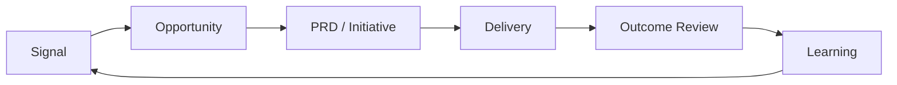

# Product OS workspace

This repository keeps product decisions and evidence in Git. Product OS machinery is managed
under `.product-os/`; do not edit it. Your files live in `context/`, `product/`, `inputs/`, and
`external/`. `.product-os/config.yaml`, `AGENTS.md`, and `CLAUDE.md` are preserved for you.

## Daily prompts

- “Process this customer signal and preview the normalized Signal before writing.”
- “Show my decision queue.”
- “Interrogate me before drafting this PRD.”
- “Review this PRD against its evidence and Outcome Contract.”
- “Which shipped work is ready for measurement?”
- “Prepare the product update from verified decisions and learnings.”

## Decision loop

## Check, update, and rollback

Ask your agent to “Check whether Product OS is healthy” to run `product-os check`.
To update, give it a trusted source checkout and ask it to follow the Update procedure in that
checkout's `INSTALL.md`. Updates stop before writing on any locally modified managed file.
Rollback an install or update with one previewed `git revert` of that operation's commit.

The worked example is not copied into this workspace. It remains at
`examples/best-in-class-trading-experience/` in the trusted Product OS source checkout.
